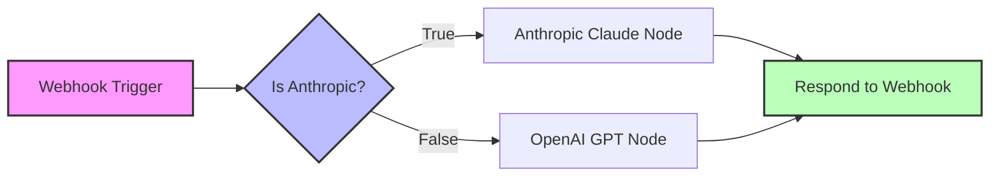
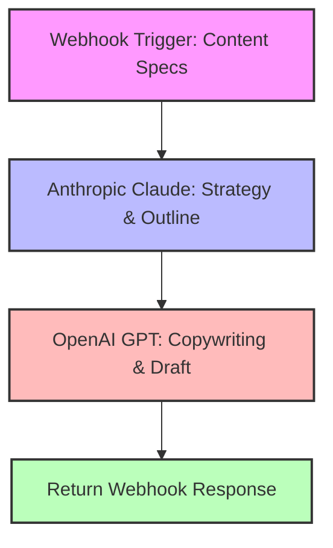

# n8n Workflow Automation Architecture

This guide describes how the visual, no-code/low-code workflow engine in n8n works and is configured in this project.

---

## 🏗️ 1. Workflow 1: Dynamic AI Chatbot (Routing Engine)

The Dynamic AI Chatbot workflow dynamically processes user chat messages and selects an LLM provider based on request parameters.

### Visual Workflow Graph

### Components

1. **Webhook Trigger (POST `/webhook/chatbot`)**
   - Receives a JSON body containing `message`, `provider`, and optional `model`.
   - Set to respond immediately using the **Respond to Webhook** node.

2. **Is Anthropic? (If Node)**
   - String check: Checks if `{{ $json.provider }}` equals `"anthropic"`.
   - If true, routes the payload to the Anthropic Chat node.
   - If false (or missing), routes the payload to the OpenAI Chat node.

3. **OpenAI Chat Node**
   - Invokes OpenAI Model (defaults to `gpt-4o` or dynamic model via `{{ $json.model }}`).
   - Set with a System Prompt: "You are a helpful and intelligent AI assistant powered by OpenAI via n8n."

4. **Anthropic Chat Node**
   - Invokes Anthropic Model (defaults to `claude-3-5-sonnet-20241022` or dynamic model via `{{ $json.model }}`).
   - Set with System Prompt parameter.

5. **Respond to Webhook**
   - Dynamically formats the output JSON.
   - Merges output fields from the active node:
     `{{ $json.choices ? $json.choices[0].message.content : $json.content[0].text }}`

---

## ✍️ 2. Workflow 2: Multi-Stage AI Content Creator (Agent Pipeline)

This workflow employs a cooperative multi-stage agent pipeline, passing outputs between different LLMs to generate high-quality documents.

### Visual Workflow Graph

### Execution Logic

1. **Webhook Trigger (POST `/webhook/content-creator`)**
   - Expects parameter inputs: `topic`, `content_type`, `audience`, and `tone`.

2. **Generate Outline (Anthropic Claude Node)**
   - Anthropic Claude is excellent at reasoning and structuring. We send it the topic to create a detailed document structure/outline.
   - Output includes sections, headers, and SEO guidance.

3. **Generate Draft (OpenAI GPT Node)**
   - OpenAI GPT excels at creative copywriting. We send it the outline generated by Anthropic, along with the user's desired tone and target audience.
   - It writes the final copy in formatted markdown.

4. **Return Content (Respond to Webhook)**
   - Delivers both the **outline** and the **final_content** draft as a unified JSON response.

---

## 🛠️ Triggers, Webhooks & Debugging

- **Webhooks URL Testing vs Production**:
  - While developing in the n8n UI, use the **Test Webhook URL** (e.g. `/webhook-test/chatbot`). This requires you to click "Listen for test event" inside n8n to inspect the incoming payload.
  - For continuous production use, toggle the workflow switch to **Active** and call the **Production Webhook URL** (e.g. `/webhook/chatbot`).
- **Debugging Payload Execution**:
  - Open n8n, navigate to **Executions** tab to view historical runs, inspect data inputs/outputs on individual nodes, and troubleshoot credential errors.